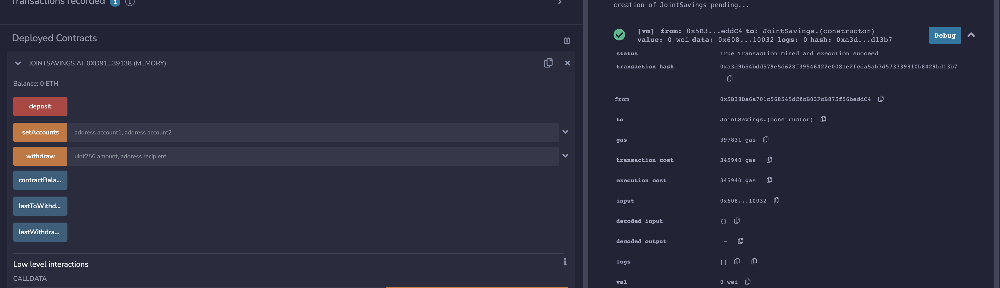
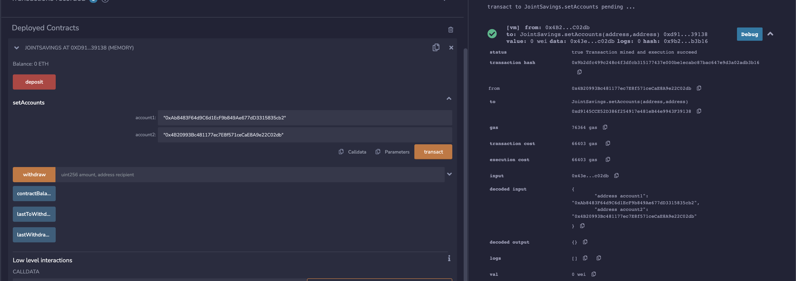

# Joint Savings Account


## Background

A fintech startup company has recently hired you. This company is disrupting the finance industry with its own cross-border, Ethereum-compatible blockchain that connects financial institutions. Currently, the team is building smart contracts to automate many of the institutions’ financial processes and features, such as hosting joint savings accounts.

## The Contract In Action

### Deployment
Here we can see the deployed contract in the Remix IDE which exposes all the methods of the contract. On the right-hand side we can also see the output of deploying the contract.


### Set Accounts
Here we can see the `setAccounts` method in action. We provide two addresses, one for each account. And on the right-hand side we can again see the output of calling this method.


### Depositing
<h4>Depositing 1000000000000000000 Wei:</h4>
Here we can see that the value to be transacted is `1000000000000000000 Wei` which is `1 Ether`.
 

<h4>Checking the updated balance of the contract:</h4>
Here we can see the output of the deposit on the right-hand side, as well as the output/value of the `currentBalance` variable, which has been set to `1000000000000000000` which signifies that the current balance is valued at `1000000000000000000 Wei` or `1 Ether`. 


<h4>Depositing 10000000000000000000 Wei:</h4>  
Here we can see that the value to be transacted is `10000000000000000000 Wei` or `10 Ether`. 


<h4>Checking the updated balance of the contract:</h4> 
Here we can see the output of the deposit on the right-hand side, as well as the output/value of the `currentBalance` variable, which has been set to `11000000000000000000` which signifies that the current balance is valued at `11000000000000000000 Wei` or `11 Ether`. 


<h4>Depositing 5 Ether:</h4>  
Here we can see that the value to be transacted is `5 Ether` or `5000000000000000000 Wei`.
 

<h4>Checking the updated balance of the contract:</h4>
Here we can see the output of the deposit on the right-hand side, as well as the output/value of the `currentBalance` variable, which has been set to `16000000000000000000` which signifies that the current balance is valued at `16000000000000000000 Wei` or `16 Ether`. 


### Withdrawal
<h4>Withdrwaing 5000000000000000000 Wei/5 Ether:</h4>
Here we can see the withdraw function in action. We set the amount parameter to `5000000000000000000` which is equivalent to `5000000000000000000 Wei` or `5 Ether`. We then set the recipient parameter to the address of the first account. We can see the output of the transaction on the right-hand side. And finally the output/value `currentBalance` variable has been set to `11000000000000000000` which is equivalent to `11000000000000000000 Wei` or `11 Ether`. 
  

<h4>Withdrwaing 10000000000000000000 Wei/10 Ether:</h4>
Here we can see the withdraw function in action. We set the amount parameter to `10000000000000000000` which is equivalent to `10000000000000000000 Wei` or `10 Ether`. We then set the recipient parameter to the address of the seccond account. We can see the output of the transaction on the right-hand side. And finally the output/value `currentBalance` variable has been set to `1000000000000000000` which is equivalent to `1000000000000000000 Wei` or `1 Ether`.


## Getting Started

1. Open the Remix IDE here: [Remix IDE](https://remix.ethereum.org/)
2. Copy and paste the code from [join_savings.sol](https://github.com/SZun/Joint-Savings-Account/blob/main/joint_savings.sol) into a file in the Remix IDE. 
3. Compile the contract 
4. Deploy the contract 

## Clone Repository
```
$ git clone git@github.com:SZun/Joint-Savings-Account.git
$ cd Joint-Savings-Account
```

## Built With
[]([https://docs.soliditylang.org/en/latest/) *Programming Language*


## Contributors
- **Sam G. Zun** - [LinkedIn](https://www.linkedin.com/in/szun/) | [GitHub](https://github.com/SZun)
